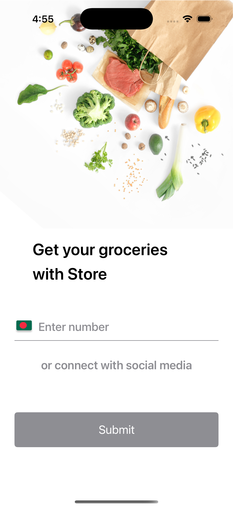
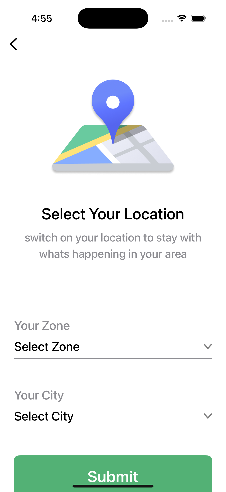
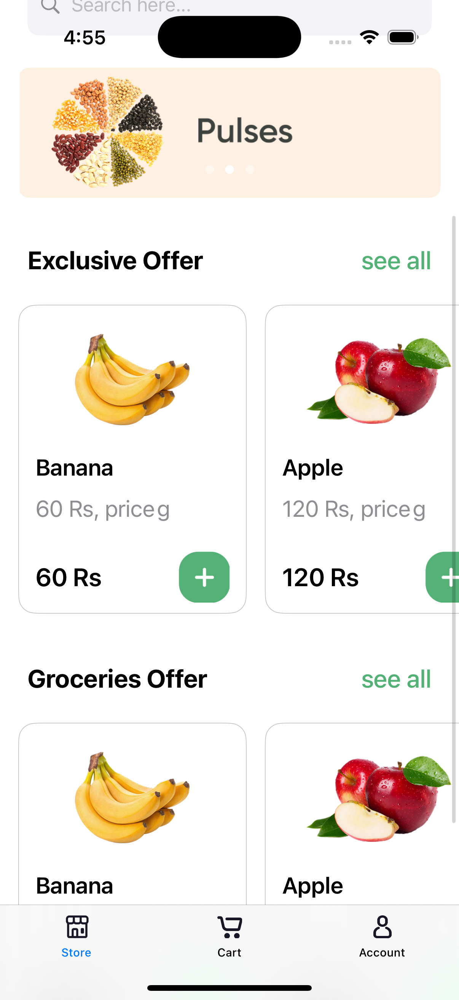
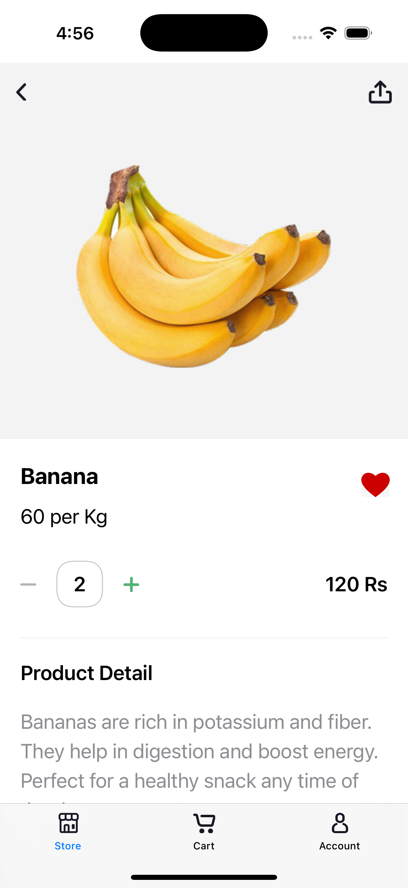
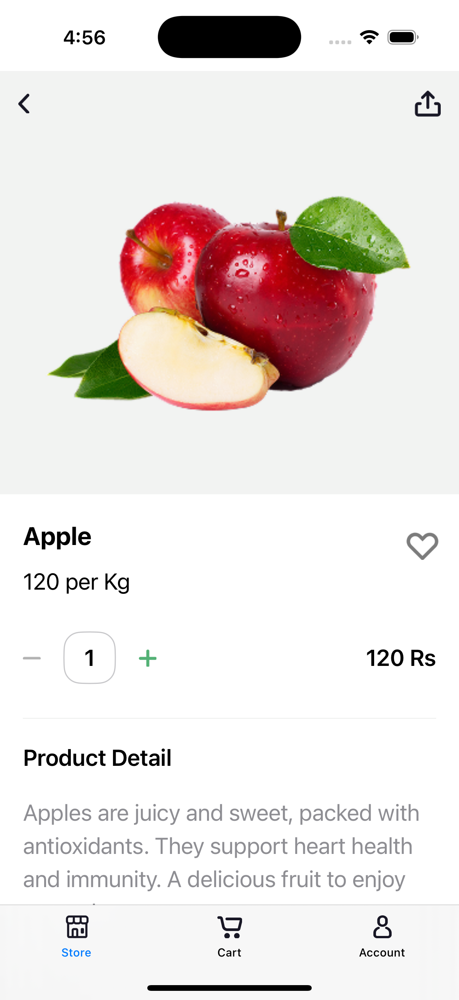
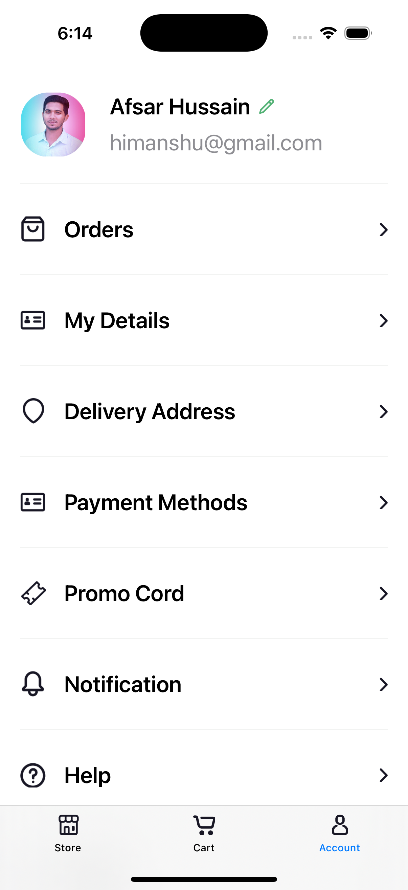
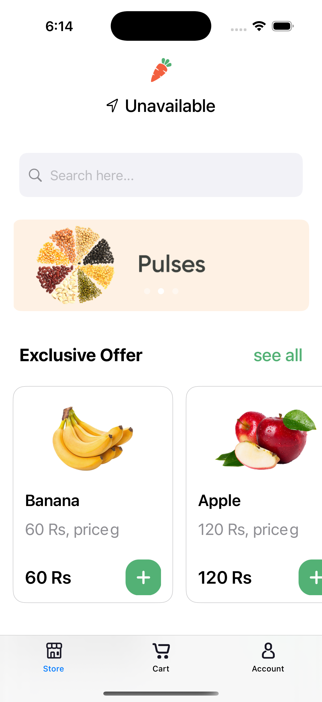
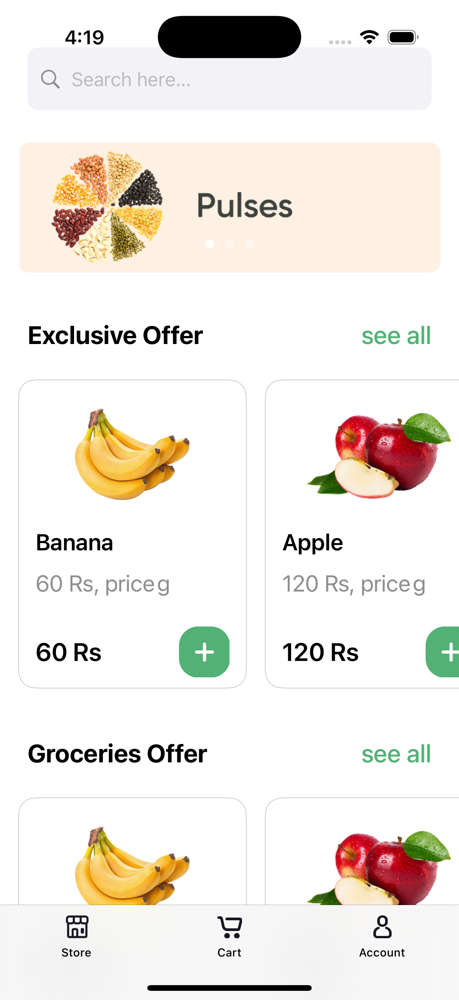
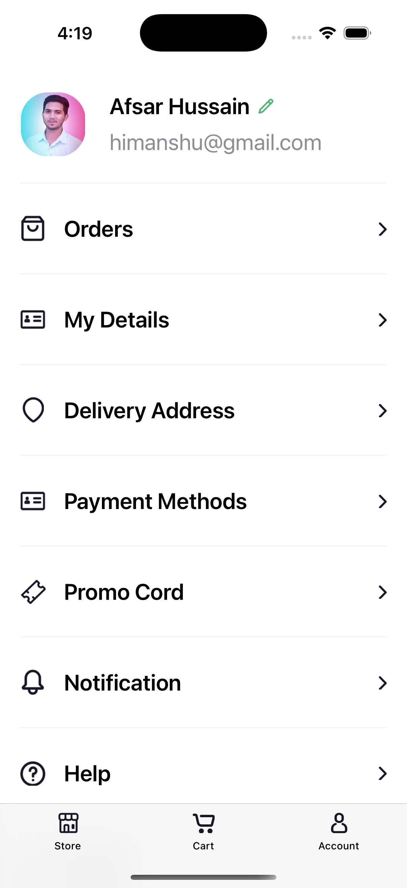

# 🛒 Grocery App (SwiftUI)

A simple and modern **Grocery Shopping App** built with SwiftUI.

---

## 🎥 Demo


---

## 📸 Screenshots

| Home | Products | Cart |
|------|----------|------|
|  |  |  |

| Checkout | Profile | Orders |
|----------|----------|--------|
|  |  |  |

| Search | Categories | Offers | Settings |
|--------|------------|--------|----------|
|  |  |  |  |

---

## ✨ Features
- Browse products by category
- Search and filter products
- Add / remove items in cart
- Simple checkout flow
- Clean UI made entirely with **SwiftUI**

---

## 🛠 Tech Stack
- Swift 5
- SwiftUI
- MVVM Architecture

---

## 🚀 How to Run
1. Clone the repo  
   ```bash
   git clone https://github.com/Danish1111/GroceryApp-ios.git

